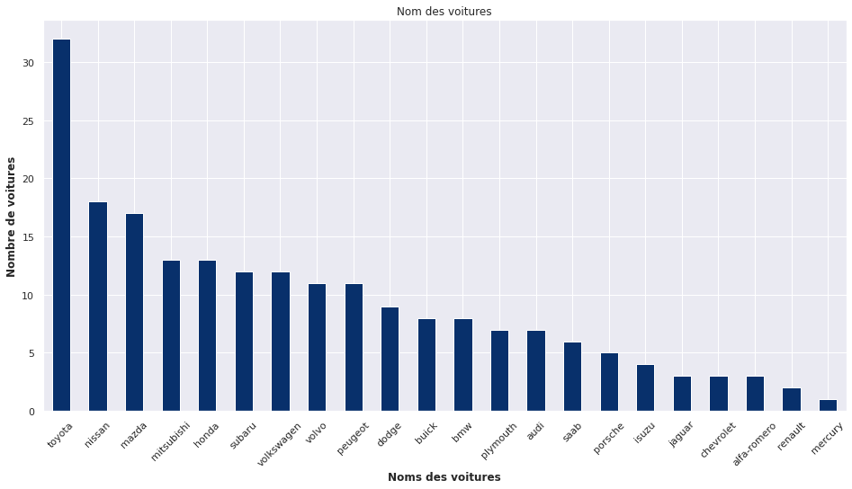
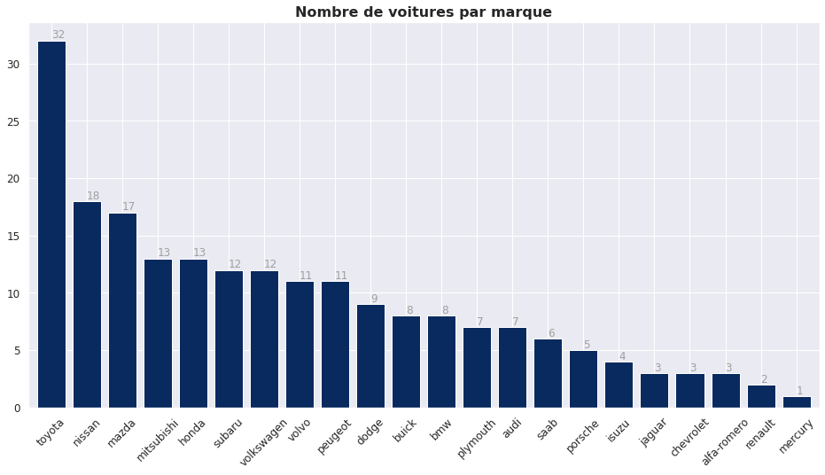
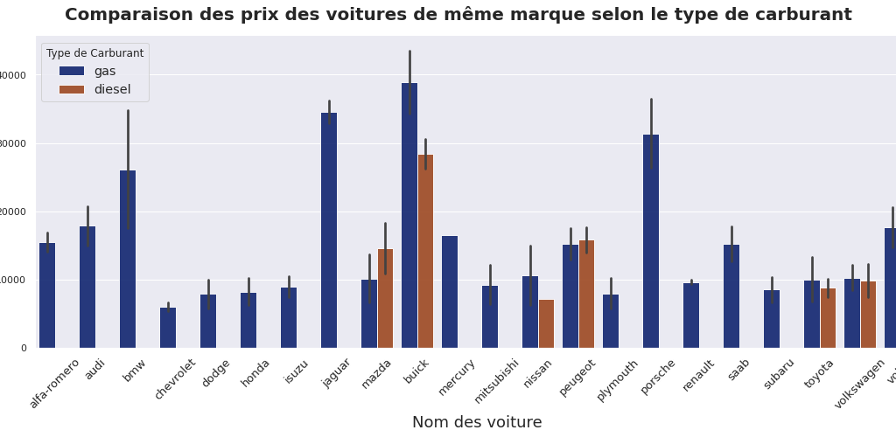

# Bar Chart
Les graphiques à barres affichent les données par catégories (verticalement ou horizontalement) – pour analyser la fréquence, le rang et l’écart.
Dans le module PyPlot de Matplotlib il y a une fonction qui permet de créer un graphique à barres très facilement.

Dataset CarPriceAssignement

## Afficher le nombre de voiture par marque

## Ajouter le nombre de voiture sur chaque bar

## Graphique à barres groupées

Le tutoriel complet est sur cette page [ICI](https://blog.sinatechnologie.com/graphique-a-barres)
